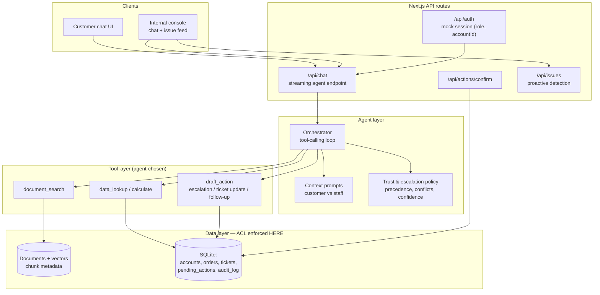

# Development Plan & Architecture — ParcelPilot AI Support System

> Companion to `README.md` (the project brief). This file locks in **what to build, in what
> order, and how the pieces fit together**, so any AI model or developer can continue work
> without re-deciding fundamentals. Read both files before coding.

---

## Part 1 — Locked-In Technical Decisions

Do **not** re-litigate these in future sessions. Change only with a written reason here.

| # | Decision | Choice | Why |
|---|---|---|---|
| D1 | Stack | **Next.js 14+ App Router, TypeScript**, single repo | One deployable (frontend + API routes), trivially hostable on Vercel/Railway |
| D2 | LLM access | **OpenAI-compatible SDK**, `LLM_BASE_URL` + `LLM_API_KEY` + `LLM_MODEL` env vars | Provider-agnostic (OpenAI/Groq/OpenRouter/any compatible gateway); no vendor lock-in |
| D3 | Agent runtime | **Hand-rolled tool-calling loop** (`lib/agent/orchestrator.ts`) | Full control of traces, confirmation gates, and escalation logic; no framework magic to debug |
| D4 | Persistence | **SQLite** (one `data/app.db`, gitignored) — documents table + vectors, structured tables, `pending_actions`, `audit_log`, `meta` | Zero external services, reproducible local runs, still real SQL with enforced scoping |
| D5 | Retrieval | **Chunked PDFs → embeddings stored in SQLite → cosine similarity in-process** (+ keyword fallback via FTS5) | No paid vector DB; adequate for a 6-document corpus; hybrid search improves recall |
| D6 | Auth | **Mock session**: user-switcher endpoint sets a signed cookie with `{userId, role, accountId}` | Requirement allows mocking; identity is resolved **server-side only**, never from client input |
| D7 | State-changing actions | Persisted as **pending_actions** rows; executed only after explicit confirm; fully audit-logged | Meets confirmation requirement and gives a demoable trail |
| D8 | Reference time | Read once from the workbook's **README sheet** at seed time → `meta.reference_time`; injected into prompts and used for ALL date math | Assessment mandates the snapshot time as the clock |

### Source authority precedence (trust layer core)

```
1. Account-matched customer agreement   (only for that account; may override general policy)
2. CURRENT policy / SOP v4              (general default)
3. Product operations guide + known issues
4. DEPRECATED policy v2                 (excluded from answers; allowed only if the user
                                         explicitly asks about history — labelled as such)
5. Historical ticket resolutions        (context/hints ONLY — never cited as authority;
                                         treated as possibly incorrect)
```

Every retrieved chunk carries metadata: `{docId, title, version, status: current|deprecated|customer_agreement|ticket_history, accountId?}`. The orchestrator applies this matrix when synthesizing answers and when detecting conflicts.

---

## Part 2 — System Architecture

### High-level view



### Request lifecycle (every chat turn)

1. **Identity resolution** — server reads the mock-session cookie → `{role, accountId}`. The client never passes account IDs.
2. **Guardrails** — strip/flag attempts to change identity; classify obvious out-of-scope requests.
3. **Orchestrator loop** (max N steps, e.g. 8): LLM sees system prompt + conversation + tool schemas; it calls tools; tool results are appended; repeat until final answer or escalation.
4. **Tool execution** — each tool independently enforces scope (see below) and returns structured JSON + human-readable summary used as the tool-call trace in the UI.
5. **Synthesis under trust policy** — answer must cite sources; conflicts are surfaced ("your agreement overrides standard policy"); low-confidence/no-evidence → propose escalation instead of guessing.
6. **State-changing actions** — never executed inline. Tool creates a `pending_actions` row and returns a preview; UI renders Confirm/Cancel; `/api/actions/confirm` executes and writes `audit_log`.
7. **Streaming response** — answer tokens stream to the client alongside a visible timeline: `tool used → inputs → result → sources`.

### Access-control model (enforced in the data layer, D6/D-requirement)

| Role | accountId scope | Documents | Orders/Tickets | Actions |
|---|---|---|---|---|
| `customer_admin` / `customer_user` | own account only | general docs + own agreement only | own account only | request escalations for own account |
| `support_agent` (tier-1) | all accounts (read) | all except other customers' agreement terms unless working that ticket | all (read) | draft escalations, follow-ups |
| `ops_manager` (tier-2) | all | all | all (read/write) | approve/execute escalations, ticket updates |

Implementation rule: repository functions in `lib/data/repositories/*` take the session context as a mandatory parameter and append `WHERE account_id = :sessionAccountId` (or role checks) to **every** query. Tools cannot bypass repositories. Prompt-level instructions are a second line of defense, never the first.

### Tool specifications

**T1 `document_search(query, filters?)`**
- Hybrid retrieval: embedding cosine + FTS5 keyword, merged.
- Filters: `status` (exclude deprecated by default; ticket-history chunks excluded from citations entirely), `accountId` (auto-injected from session).
- Returns: ranked chunks with metadata + score; the orchestrator receives authority tiers so synthesis can prefer higher tiers.

**T2 `data_lookup(entity, query)` / `calculate(expression, params)`**
- Entities: `order` (by ORD id, auto-checked against session account), `account`, `tickets`.
- Calculations: service-credit eligibility math, SLA remaining/breach, cancellation fee per agreement+SOP — computed in code from DB values, **not** by the LLM doing arithmetic.
- Every result includes the resolved `accountId` so the UI/log proves scoping.

**T3 `draft_action(kind, params)`**
- Kinds: `create_escalation`, `update_ticket`, `create_follow_up_task`.
- Writes `pending_actions(status='awaiting_confirmation')` + returns preview card (what will change).
- Execution happens only via `/api/actions/confirm` after explicit user confirmation; writes `audit_log`.

### Proactive issue detection (internal view)

Batch heuristics recomputed on demand by `/api/issues` over the seeded dataset:

| Signal | Heuristic |
|---|---|
| Complaint spike | category count in last 48h (relative to reference_time) > 2× trailing 7-day daily mean |
| Product-issue cluster | ticket keywords matching entries from the Known Issues doc |
| SLA risk | high-severity open tickets with remaining SLA < 25% or breached |
| Cross-account incident | ≥ N distinct accounts sharing carrier + lane + failure type in window |
| Unusual order pattern | z-score anomaly on order volumes/cancellations per carrier |

Each finding links to underlying tickets/orders so staff can drill in, plus a one-click "draft escalation" that reuses T3.

### Folder structure

```
src/
  app/
    page.tsx                    # customer chat (context = customer)
    internal/page.tsx           # staff console: chat + issues dashboard
    api/auth/route.ts           # mock user switcher
    api/chat/route.ts           # streaming orchestrator endpoint
    api/actions/confirm/route.ts
    api/issues/route.ts
  lib/
    agent/orchestrator.ts       # D3 loop
    agent/prompts.ts            # customer vs internal system prompts
    agent/trust.ts              # precedence, conflict & confidence rules
    tools/{registry,documentSearch,dataLookup,draftAction}.ts
    data/db.ts                  # sqlite client (D4)
    data/ingest/pdf.ts          # chunk + embed + store
    data/ingest/xlsx.ts         # sheets -> tables + meta.reference_time (D8)
    data/repositories/*.ts      # ALL queries live here; ACL applied here
    auth/session.ts             # cookie sign/verify, role defs
  components/chat/*.tsx         # message list, tool-trace timeline,
                                # citation chips, action-confirm cards
scripts/seed.ts                 # builds data/app.db from data/raw/*
data/raw/                       # supplied pack (committed)
data/app.db                     # generated (gitignored)
.env.example
```

### Environment variables

```
LLM_BASE_URL=            # OpenAI-compatible endpoint
LLM_API_KEY=
LLM_MODEL=               # chat model
EMBED_MODEL=             # embeddings (if separate)
SESSION_SECRET=
PORT=3000
```

---

## Part 3 — Task Plan (execute in order)

Legend: ☐ pending · each phase ends runnable. Update this file's checkboxes as you go.

### Phase 0 — Scaffold (½ day)
- [ ] P0.1 `create-next-app` (TS, App Router, src dir), install `openai`, `better-sqlite3`, `xlsx`, `pdf-parse`/`unpdf`
- [ ] P0.2 Commit the supplied data pack into `data/raw/` (7 files)
- [ ] P0.3 `.env.example`, wire env loading, verify `.kilo/` + `data/app.db` ignored
- [ ] P0.4 Stub pages: customer chat, internal console (blank)

### Phase 1 — Data ingestion (1 day)
- [ ] P1.1 XLSX importer: accounts, orders, tickets → SQLite; parse README sheet → `meta.reference_time`; flag ticket-resolution rows as `ticket_history`
- [ ] P1.2 PDF importer: extract text → chunk (~500 tok, 50 overlap) → embed → store with metadata `{docId, status, version, accountId?}`
- [ ] P1.3 FTS5 index on chunks + orders/tickets text fields
- [ ] P1.4 `npm run seed` rebuilds everything deterministically; smoke-check counts

### Phase 2 — Auth & data layer (½ day)
- [ ] P2.1 Mock users: Northstar admin, Northstar user, LumenWorks user, ParcelPilot support_agent, ops_manager
- [ ] P2.2 Session cookie sign/verify + `/api/auth` switcher UI (header dropdown)
- [ ] P2.3 Repositories with mandatory session-scoped queries; unit-test that cross-account lookups return empty/403

### Phase 3 — Agent core (2 days)
- [ ] P3.1 Orchestrator loop (D3): tool schemas, step cap, streaming events (`tool_call`, `tool_result`, `token`, `citation`)
- [ ] P3.2 Implement T1 document_search (hybrid, authority-tiered results)
- [ ] P3.3 Implement T2 data_lookup + calculate (code-side math: fees, credits, SLA)
- [ ] P3.4 Implement T3 draft_action → pending_actions
- [ ] P3.5 Trust module: precedence application, deprecated-doc exclusion, conflict surfacing, confidence gate → escalation proposal
- [ ] P3.6 Context prompts: customer (own-account framing, polite escalation) vs internal (investigative, ops language)

### Phase 4 — Chat UX (1 day)
- [ ] P4.1 Streaming message list with visible tool-trace timeline (which tool ran, inputs, result summary)
- [ ] P4.2 Citation chips (doc title + version badge CURRENT/DEPRECATED/AGREEMENT/TICKET-HISTORY)
- [ ] P4.3 Action-confirm cards wired to `/api/actions/confirm`; cancel path; audit-log write
- [ ] P4.4 Escalation UX: when agent proposes human handoff, show summary + created escalation

### Phase 5 — Scenario hardening (1 day)
- [ ] P5.1 Golden-question suite (runnable script/notebook), at minimum:
  - Northstar cancels `ORD-1001` without fee? (agreement override + order lookup + SOP)
  - Pickup 3h late, carrier fault → service credit? (SOP + calculation)
  - Deprecated-policy trap question (v2-only answer must be refused/corrected)
  - Wrong-ticket-advice trap (historical resolution contradicts current SOP → follow SOP, note discrepancy)
  - Cross-account probing (logged-in LumenWorks user asks for Northstar order → refused)
  - Multi-step: order → account → agreement → SOP → calc → escalation draft
- [ ] P5.2 Fix failures; tune chunking/prompts; record known limitations

### Phase 6 — Proactive issue detection (1 day)
- [ ] P6.1 `/api/issues` heuristics (table above) relative to `reference_time`
- [ ] P6.2 Dashboard cards: signal, severity, linked tickets/orders, trend sparkline
- [ ] P6.3 Drill-in → reuse internal chat prefilled with the finding; one-click draft escalation

### Phase 7 — Ship (1 day)
- [ ] P7.1 Deploy (Vercel/Railway; SQLite caveat → use persistent volume or Turso/libSQL if needed — decide at deploy time, note it here)
- [ ] P7.2 Architecture note + product note drafts (from Parts 1–3 of this file)
- [ ] P7.3 ~5-min demo video script: arch (60s) → customer demo incl. confirmation (90s) → internal demo + issues (90s) → decisions/trade-offs (40s)
- [ ] P7.4 Submit form with repo + hosted URL

### Definition of done (per requirement)
R1 NL chatbot ✅ Phase 3–4 · R2 access control ✅ Phase 2 · R3 three tools ✅ Phase 3 ·
R4 confirm-before-action ✅ P4.3 · R5 multi-step ✅ P5.1 · R6 UI with tool visibility ✅ P4.1 ·
Extra problems ✅ Phases 3.5 (trust) + 6 (detection).

---

## Part 4 — Deliberate Non-Goals for v1 (state these in the product note)

- No real authentication provider (mocked per brief), no payments/refunds execution
- No multi-tenant vector DB / microservices — single process by design
- No fine-tuning; retrieval + prompting only
- No real-time integrations with carriers (dataset is a static snapshot)

## Part 5 — Suggested Success Metric (for the product note)

**Cited-answer accuracy rate**: % of answered queries whose cited sources actually support the answer (sampled audit), paired with **unnecessary-escalation rate**. Together they capture the trust trade-off: helpful without being confidently wrong, escalating only when genuinely needed.
